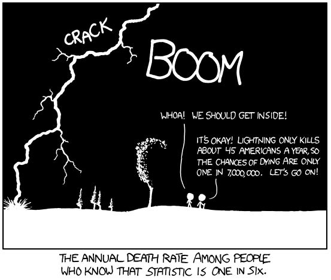
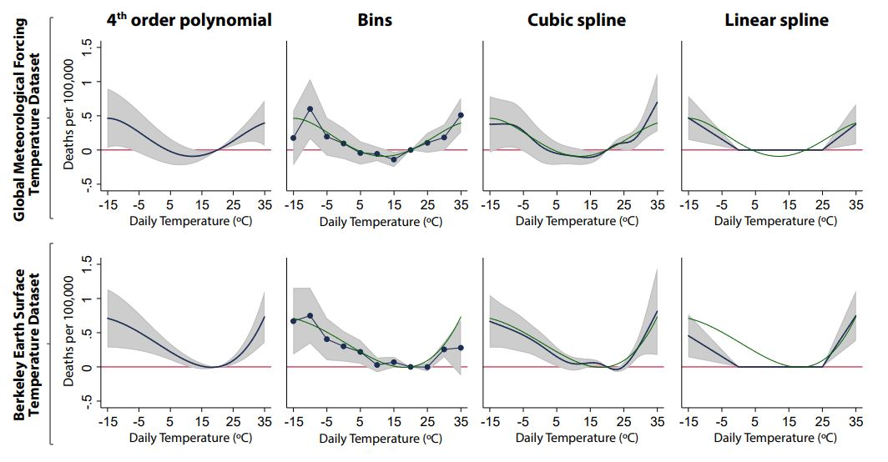

# 2. Developing a reduced-form specification

This section describes some of the considerations that go into developing a reduced-form specification using weather panel data. For an extensive review of the results available from the climate econometric literature and the empirical methods used to identify them, a good resource is [Social and Economic Impacts of Climate](http://science.sciencemag.org/content/353/6304/aad9837).

## 2.1. Choosing weather variables

The choice of weather variables depends on the question we are trying
to answer, and there are many forms to represent any given
variable. For example, in the case of temperature, we can use
$T_{avg}$, $T_{min}$, $T_{max}$, days above 30 C, heating and cooling
degree-days, or growing degree-days. Morevoer, it is very important to
first think about possible *mechanism(s)* behind a change witnessed in
the environment, and then only make choices for variables that can
explain that mechanism. A few of the important and frequently-used
weather variables are listed below, and why you might choose them:

- **Temperature:** Temperature relationships are often preferred in
  climate impacts research, because temperature is more predictable
  than many other weather variables. There are various measures of temperature that can be used. Some of them are listed below:
    1. *$T_{min}$, $T_{max}$:*  Many socioeconomic processes are more
       sensitive to extreme temperatures than to variation in the
       average. This is also useful when temperature variation is
       large, leading to significant differences in the cold end and hot end responses. These are important metrics when heterogeneity within time units matters, and may better capture heat waves and cold spells. Also, note that $T_{min}$ better reflects nighttime temperatures while $T_{max}$ better reflects daytime temperatures. Not all datasets include $T_{min}$ or $T_{max}$. 
    2. *$T_{avg}$:*  A good mean metric for seeing average response
       over the temperature support, when there is not much variation
       in temperature within each time unit considered in the
       study. $T_{avg}$ is most appropriate when there is some natural
       inertia in the response, so that the dependent variable is
       responding to a kind of average over the last 24 hours. Note
       that $T_{avg}$ is often just equalt to $(T_{min} + T_{max}) / 2$, unless calculated from sub-daily data.
    3. [*HDD/CDD & GDD:*](https://www.degreedays.net/introduction)
       Degree days (DD) are a measure of ’how much’ and for ’how long’
       the outside air temperature was above or below a certain
       level. A sinusoid between $T_{min}$ and $T_{max}$ can be used
       to approximate DDs from daily data.
    4. *Heat Index & Wet Bulb Temperature*: (see below on humidity)

- **Humidity:** There are mainly three metrics for humidity
  measurements: absolute, relative (often "RH"), and
  specific. Absolute humidity describes the water content of air,
  expressed in grams per cubic metre or grams per kilogram. Relative
  humidity is expressed as a percentage relative to a maximum humidity
  value for a given temperature. Specific humidity is the ratio of water vapor mass to total moist air parcel mass. Human (and animal) bodies rely on evaporative cooling to regulate temperature in hot weather, the effectiveness of which depends on how much more moisture the atmosphere can currently hold (1 - RH). As a result, various temperature-humidity metrics have been developed to estimate "apparent" temperature, i.e. the temperature the current weather "feels like": 
    1. *Wet-Bulb Temperature (WBT)*: the temperature read by a thermometer covered in water-soaked cloth (wet-bulb thermometer) over which air is passed. Gives the lowest temperature that can be reached under current conditions by evaporative cooling only. Equals air temperature at 100% relative humidity, and is lower at lower humidity. 
    2. *Wet-Bulb Globe Temperature (WBGT)*: a weighted index that combines WBT with measures of the impact of direct radiative transfer (e.g. sunlight) 
    3. *Heat Index (HI)*: various calculated metrics combining shade temperature and relative humidity

- **Precipitation:** highly local (in space *and* time), non-normal (especially compared to temperature), poorly measured, and poorly predicted (see [Section 1.5](#1.5-A-Warning-on-Hydrological-Variables-(Precipitation,-Humidity,-etc.)). Precipitation is often used as a control since it is correlated with temperature. However, the strength and direction of this correlation varies significantly by region and time of year (see e.g. [Trenberth et al. 2005](https://agupubs.onlinelibrary.wiley.com/doi/full/10.1029/2005GL022760), with implications for collinearity). Furthermore, the same care should be taken when inserting precipitation into a model as any other weather or social variable - what is its expected role? In what form should the data be? etc. Precipitation affects society differently at different spatiotemporal scales - annual precipitation may be useful for studying snowpack trends, drinking water supply, or the effect of droughts on agriculture; maximum precipitation rates may be the relevant metric for flood damages or crop failures. Remember that though means and extremes may be correlated, it's still possible to have a record storm in an unnaturally dry year, or an unnaturally wet year without heavy precipitation. As a result, different metrics of precipitation are often used (incomplete list):  
    1. *Total precipitation (e.g., over a year)*: May be useful for large-scale impacts such as snowpack trends. Often used as a control in responses to extreme weather, despite being unsuited to studying short-term phenomena. 
    2. *Soil water, potential evapotranspiration rate (PET), Palmer drought severity index (PDSI), and water runoff/availability*: often used to capture water stress.
    3. *Number of of rainy/dry days, or moments of the precipitation distribution*: the distribution of precipitation often matters more than total.
Some datasets (such as [HadEX2](https://climatedataguide.ucar.edu/climate-data/hadex2-gridded-temperature-and-precipitation-climate-extremes-indices-climdex-data)) specialize in extremes data. 
    
- **River discharge rate:** River flows are generally measured at the station-level. While runoff is avaialble in gridded products, it is not a good reflection of water availability. Hydrological models (like VIC) can translate precipitation into river discharges across a region.

- **Wind speed:** The process of interest determines how wind speeds should be measured. For example, normal speeds are important for agriculture, squared speeds for distructive force, and cubic speeds for wind turbine power. Also consider gust velocity, which is generally available. Maximum wind speed over some time period has been used as well.  

- **Net primary productivity (NPP):** It is the difference of amount of carbon dioxide that vegetation takes in during photosynthesis and the amount of carbon dioxide released during respiration. The data come from MODIS on NASA’s Terra satellite. Values range from near 0 g of carbon/area/day (tan) to 6.5 g of carbon/area/day (dark green). A negative value means decomposition or respiration overpowered carbon absorption; more carbon was released to the atmosphere than the plants took in.

- **Evapotranspiration rate (ET):** It is the sum of evaporation and
  plant transpiration from the Earth's land and ocean surface to the
  atmosphere. Changes in ET are estimated using water stress measures
  in plants, and are related to the agricultural productivity.

- **Solar radiation:** Shortwave radiation (visible light) contains a lot of energy; longwave radiation (infrared light) contains less energy than shortwave radiation. The sun emits shortwave radiation because it is extremely hot, while the Earth re-emits heat it receives as longwave radiation in the form of infrared rays. Exposure of shortwave radiation is said to cause skin cancer, eye damage, etc. However, UV (shortwave) radiation is important for regulating vitamin D circulation in our body.

- **Sea surface temperature (SST) and ocean temperature:** SST is the water temperature close to the ocean's surface, while ocean temperature is related to ocean heat content, an important topic in the study of global warming. Weather satellites have been available to determine SST information since 1967. NASA and Moderate Resolution Imaging Spectroradiometer (MODIS) SST satellites have been providing global SST data since 2000, available with a day lag. Though SST has a large impact on global weather patterns, other metrics (such as El Niño indices - ENSO3.4, etc. - or various other oscillation indices) may be more useful in understanding its impact.  

- **Climatic indicies:** A wide range of metrics have been developed
  to understand the state of the ocean-atmosphere system at large
  scales. These are measured in a standardized way (e.g., by comparing
  temperature at two points or by extracting a mean over a region),
  and often have long time-series, often at the monthly
  level. However, they do not vary over space. Data for some of the
  most important are available
  through [NOAA](https://www.ncdc.noaa.gov/teleconnections/).  Some of
  the most important are:
      1. *El Niño/Southern Oscillation (ENSO)*: Affects temperature
         and precipitation across the globe, with hotspots on most
         continents. For some applications, the value of the signal
         will be less important than the identification of El Niño and
         La Niña phases. These phases can be somewhat predicted months
         in advance. El Niño events can be subclassified as Modoki or
         not.
	  2. *Indian Ocean Dipole (IOD)*: IOD has affects weather
         throughout East Africa, South and Southeast Asia, and
         Oceania.

## 2.2. Dealing with the spatial and temporal scales of economic processes

The process of developing a reduced-form specification starts with a
study of the "true model", or data-generating process, that relates
your dependent variable to your weather variables. A crucial aspect of
that relationship is the question of scale.

Weather data products are generally available in *gridded* form,
developed through careful interpolation and/or reanalysis. The grids
used can vary in size across datasets, but they can be aggregated to
administrative units like county, city, etc., using appropriate
weighted aggregation methods. Think about the scale of your
administrative units, relative to the scale of the grid cells. If the
regions are much bigger than the grid cells, a weighted average across
included cells is appropriate. If the regions are much smaller than
the cells, it will probably be necessary to aggregate the regions,
since the level of variation is only at the grid cell level. If the
two are of similar sizes, it may be necessary to account for the
amount of each grid cell lies within each region. This can be
calculated as a transformation matrix, with a row for each region and
a column for each cell. Once the matrix is calculated, it can be
reused for each time step. More details for this process are described
in sections 3 and 5.

Typically, relating weather to a dependent variable requires some kind
of non-linear transformation. For example, estimating a polynomial
functional form requires raising the temperatures to various powers. Importantly, the square of a weighted average of grid-level temperatures is not the same as the weighted average of the square of grid-level temperatures.

While doing the spatial aggregation, we need to decide whether we want
to transform the data first and then aggregate it
(transformation-before-aggregation) or aggregate it and then transform
it (aggregation-before-transformation). This decision is based on the
whether the phenomenon in consideration is occurring at the local
(grid or individual) scale or at the larger administrative units
(country, state, county, etc.) scale. Also, it matters what variable
is being consideration. For example, doing
aggregation-before-transformation for temperature will distort the
signal less that doing it for precipitation. This is because
precipitation is highly local both temporally and spatially; it could
rain for <1 min in <1 km radius area.

### Transformation-before-aggregation

When an economic process is occurring at the local level (for example,
for individuals or households), we need to first do our estimation at
the grid level. For example, to estimate the effect of temperature on
human mortality at the county level, we should reckon that the effect
of temperature on mortality is a local phenomenon, so the estimation
should happen at the lowest possible level.  Since the dependent
variable is a sum of individual-level outcomes, we should write down
the reduced-form specification for an individual experiencing
high-resolution weather, and then sum across all of those reduced
forms. The result is that we need to do any non-linear transformation of our weather variables at the grid level, then aggregate these values using a weighted averaging method, and feed these into our estimation procedure.

**Mathematical formulation for transformation-before-aggregation method**

We want to understand how local agents respond to weather shocks. Suppose that there exists an agent-level dose-response curve, $y_{js} = f(T_{ps})$, for a socioeconomic outcome for agent $j$, where the temperature affecting agents is in grid cell $p$ and occurs in timestep $s$ (e.g., if the agents respond on a day-by-day basis, $T_{ps}$ is the local weather for a single day).  

However, we do not observe agent-level responses. Instead, we have region-wide sums, $y_{it}$ for region $i$ and reporting period $t$. For example, if $y_{js}$ is death risk for agent $j$ for a given day, we may only observe total deaths across a region in each year, $$y_{it} = \sum_{s \in t} \sum_{j \in i} y_{js}.$$  

We can determine the agent-level response $f(T_{ps})$ if we assume
linearity. First, let us represent this the way we would if we could run a regression with agent-level data, breaking up the dose-response
curve into a sum of terms:  
$$f(T_{ps}) = \beta_1 g_1(T_{ps}) + \beta_2 g_2(T_{ps}) + \cdots + \beta_k g_k(T_{ps})$$  

where $g_k(T_{ps})$ is a transformation of the weather variables. For example, for a cubic response curve, $g_1(T_{ps}) = T_{ps}$, $g_2(T_{ps}) = T_{ps}^2$, and $g_3(T_{ps}) = T_{ps}^3$.  

We know that  
$$y_{it} = \sum_{s\in t} \sum_{j\in i} y_{js} = \sum_{s\in t} \sum_{j\in i}$$
$$\beta_1 g_1(T_{ps}) + \beta_2 g_2(T_{ps}) + \cdots + \beta_k g_k(T_{ps})$$  

We can rearrange this to  
$$y_{it} = \beta_1 (\sum_{s\in t} \sum_{j\in i} g_1(T_{ps})) + $$
$$\beta_2 (\sum_{s\in t} \sum_{j\in i} g_2(T_{ps})) + \cdots + $$
$$\beta_k (\sum_{s\in t} \sum_{j\in i} g_k(T_{ps}))$$  

That is, the variables used in the regression should be the sum over
weather data that has been transformed at the grid level.

### Aggregation-before-transformation

% Let us try to understand these
%two methods using counties (ADM2) as our higher administrative level:

When an economic process is occurring at the regional level, we need
to first aggregate weather variable to that level before transforming
it. For example, to estimate the effect of storm events on public
service employment at the administrative office level, we need to take
into account the fact that hiring/firing of public service employees
happens at the office level only.  Estimating grid-level effects will
lead to wrong estimation, as it should result in zero estimate for
those (almost all) grid cells which do not have contain administrative
offices, and extremely large values for those (very few) cells, which
do.

Using the formulation above, here we would regress:
$$y_{it} = \beta_1 g_1(\sum_{s\in t} \sum_{j\in i} T_{ps}) + $$
$$\beta_2 g_2(\sum_{s\in t} \sum_{j\in i} T_{ps}) + \cdots + $$
$$\beta_k g_k(\sum_{s\in t} \sum_{j\in i} T_{ps})$$

Where $T_{ps}$ is the gridded weather for cell $p$ in time step
$s$, $g_k(\cdot)$ is the non-linear transformation (e.g., raising to
powers for polynomials), and $y_{it}$ is the dependent variable
observed for region $i$ in reporting period $t$. Weather data products can have temporal resolution finer than scale of daily observations. Like spatial aggregation, we can do temporal aggregation to month, year, or decade.

## 2.3. Common functional forms (pros, cons, and methods)

Returning to the "true model" of your process, the decisions around how to
generate a linear expression that you can estimate have important
implications. Different functional forms serve different purposes and
describe different underlying relationships. Some of the frequently used functional forms along with a good reference for understanding them in detail are listed below.

Consider a grid $\theta$ located in county $i$ with $T_{\theta it}$ as its temperature at time $t$. We want to generate an aggregate temperature transformation, $f(T_{it}^k)$, for county $i$ at time $t$, after aggregating over the grids $\theta \in \Theta$, where $\Theta$ denotes the set of grids that are located inside county $i$. Here, $k\in\{1,2,...,K\}$ denotes the $k^{th}$ term of transformation. For example, in case of $K$-degree polynomial transformation, it will be $K$ polynomial terms, and in case of $K$-bins transformation, it will be $K$ temperature bins. So, we can write:  
$$f(T_{it}^k)=g(T_{\theta it})$$
where, $g(.)$ denotes the transformation mapping on the grid-level temperature data.
Once we have $f(T_{it}^k)$ for each $k\in\{1,2,...,K\}$, we can use them to generate the full nonlinear transformation $F(T_{it})$, associating $\beta^k$ parameter with $k^{th}$ term of transformation. We have:  
$$F(T_{it})=\sum_{k\in \{1,2,...,K\}} \beta^k*f(T_{it}^k)$$

- **[Bins](https://pubs.aeaweb.org/doi/pdfplus/10.1257/app.3.4.152)**
    1. Assignment of observations to bins. e.g.  15C-20C, 20C-25C, ...  for temperature
    2. Uses the mean metric, so its advantage is non-parametric nature
    3. Highly susceptible to existence of outliers in data
    
    Consider doing a 6-bins bin transformation of temperature variable. Let us take equal sized bins for simplicity, but in       actual binning procedure, we might want to have smaller sized bins around the temperature values where we expect most of       the response to occur. For now, the $K=6$ temp bins are: $<-5^\circ C$, $-5^\circ C-5^\circ C$, $5^\circ C-15^\circ C$,       $15^\circ C-25^\circ C$, $25^\circ C-35^\circ C$ and $>35^\circ C$.  
    
    As defined earlier, the grid $\theta$ temperature is $T_{\theta i t}$. For transformation, we will have to map actual         temperature observations to the respective bins that we have defined above. Then, take the weighted average of these terms     across all the grids that come under a specific county. The mapping is defined as follows:  
    
    $$f(T_{it}^k)=\sum_{\theta \in \Theta} \psi_{\theta} \sum \mathbf{1} \left \{  {T_{\theta i t} \in k} \right \}$$             $$\forall k \in \{1,2,...,6\}$$  
    where $\psi_{\theta}$ is the weight assigned to the $\theta$ grid.  
    
    The aggregate transformation is as below:  
    $$F(T_{it})=\sum_{k\in \{1,2,...,6\}} \beta^k*f(T_{it}^k)$$

- **[Polynomial](https://en.wikipedia.org/wiki/Polynomial_regression)**
    1. Fitting an n-degree polynomial function for weather variables
    2. More poly degrees provide better data fitting
    3. Smooth curve nature doesn’t highlight important irregularities in data
    
    Consider doing a 4-degree polynomial transformation of temperature variable. We need to first generate the remaining           polynomial terms, namely $T_{\theta i t}^2$, $T_{\theta i t}^3$ and $T_{\theta i t}^4$, by raising original $T_{\theta i       t}$ to powers 2, 3 and 4 respectively. Then, take the weighted average of these terms across all the grids that come under     a county. So, we have:  
    
    $$f(T_{it}^k)=\sum_{\theta \in \Theta} \psi_{\theta}*T_{\theta i t}^k$$ $$\forall k \in \{1,2,3,4\}$$  
    where $\psi_{\theta}$ is the weight assigned to the $\theta$ grid.  
    
    The aggregate transformation is as below:  
    $$F(T_{it})=\sum_{k\in \{1,2,3,4\}} \beta^k*f(T_{it}^k)$$

- **[Restricted cubic spline](https://support.sas.com/resources/papers/proceedings16/5621-2016.pdf)**
    1. Fitting a piecewise polynomial function between pre-specified knots
    2. More independence compared to poly in choosing function knots
    3. Highly parametric due to freedom of choice of knots
    
    For transforming the temperature data into restricted cubic splines, we need to fix the location and the number of knots.     The reference above on cubic splines can be helpful in deciding the knot specifications. As before let the grid $\theta$       temperature be $T_{\theta i t}$. Let us do this exercise for $n$ knots, placed at $t_1<t_2<...<t_n$, then for $T_{\theta i     t}$, which is a continuous variable, we have a set of $(n-2)$ new variables. We have:  
    $$f(T_{i t}^k)= \sum_{\theta \in \Theta} \psi_{\theta}*\{(T_{\theta i t}-t_k)^3_+ - (T_{\theta i t} - t_{n-                   1})^3_+*\frac{t_n-t_k}{t_n-t_{n-1}}+(T_{\theta i t} - t_{n})^3_+*\frac{t_{n-1}-t_k}{t_{n}-t_{n-1}}\}$$ $$\forall k \in \{1,2,...,n-2\}$$ 
    where, $\psi_{\theta}$ is the weight assigned to the $\theta$ grid.  
    
    And, each spline term in the parentheses $(\nabla)^3_+$ e.g. $(T_{\theta i t} - t_{n-1})^3_+$ is called a truncated           polynomial of degree 3, which is defined as follows:  
    $\nabla^3_+=\nabla^3_+$ if $\nabla^3_+>0$  
    $\nabla^3_+=0$ if $\nabla^3_+<0$  
    
    The aggregate transformation is as below:  
    $$F(T_{it})=\sum_{k\in \{1,2,...,n-2\}} \beta^k*f(T_{it}^k)$$

- **[Linear spline](http://people.stat.sfu.ca/~cschwarz/Consulting/Trinity/Phase2/TrinityWorkshop/Workshop-handouts/TW-04-Intro-splines.pdf)**
    1. Fitting a line between cutoff values e.g.  25C CDD/0C HDD for temp
    2. Less parametric and very useful for predicting mid-range response
    3. Linear and highly sensitive to choice of cutoff values  
    
    Linear spline is a special kind of spline function, which has two knots, and the segment between these two knots is a linear function. It is also called ‘restricted’ linear spline, since the segments outside the knots are also linear. To implement this, we first decide location of the two knots, say $t_1<t_2$. Then, closely following the cubic spline method, we get:  
    $$f(T_{it}^1)=\sum_{\theta \in \Theta} \psi_{\theta}*(T_{\theta i t}-t_2)_+$$  
    $$f(T_{it}^2)=-\sum_{\theta \in \Theta} \psi_{\theta}*(T_{\theta i t}-t_1)_+$$  
    where, $\psi_{\theta}$ is the weight assigned to the $\theta$ grid.  

    And, each spline term in the parentheses $(\nabla)_+$ e.g. $(T_{\theta i t} - t_2)_+$ is called a truncated polynomial of degree 1, which is defined as follows:  
    $\nabla_+=\nabla_+$ if $\nabla_+>0$  
    $\nabla_+=0$ if $\nabla_+<0$  

    The aggregate transformation is as below:  
    $$F(T_{it})=\sum_{k\in \{1,2\}} \beta^k*f(T_{it}^k)$$  

We generally try to work with many functional forms in a paper because it serves dual purpose of being a *sanity check* for researchers' codes, and a *robustness check* for readers' confirmation. However, we need to take decision on the *main specification* that we want in the paper. To do this, we formally rely on tests such as cross-validation (explained below), but we can also eyeball at the *fit* of different functional forms by printing overlaid graphs in a way that is suitable for the exercise. An example is shown in the figure below:

**Example of reduced-form regression plots for different functional forms**

Source: [Carleton et al. (2019)](https://papers.ssrn.com/sol3/papers.cfm?abstract_id=3224365).

## 2.3. Cross-validation

Cross-validation can be done to check the *internal validity* and the *external validity* of the model estimates. For checking
internal validity, the model can be fit to a subset of the dataset, and evaluated on the remainder. For example, you can leave particular regions out of your regression or remove a random *1/k* of your data (k-fold cross validation) instead of running a full-sample regression. For gauging external validity, model is run on some new dataset that has not been not used in the model-evaluation process. For example, by predicting the response for a new country using global regression model estimates, and comparing it to the actual observations.  

Although cross-validation is not universally performed by researchers, and many people continue to rely on the measure of R-squared statistic. However, we know from our basic statistics learning, how badly R-squared statistic can perform even in very simple cases. Therefore, cross-validation can be an effective approach for doing model-selection.  

Some examples on the use of cross-validation exercise include deciding on degree of polynomial, cutoff knots' positions for splines, etc. To do a k-fold cross validation exercise for deciding on polynomial degree, we run our test specifications (say polynomials of degree 2, 3, 4 and 5) on $k$ subsets of data, and see the curve fit for each specification on all the $k$ subsets of data. To fix a metric for making this decision, we can rely on root-mean-square-error (RMSE) statistic. So, the specification with the lowest RMSE will be the most preferred specification here. Having said that, we usually employ combination of techniques, like eye-balling and RMSE, to take decision on most preferred specification.
