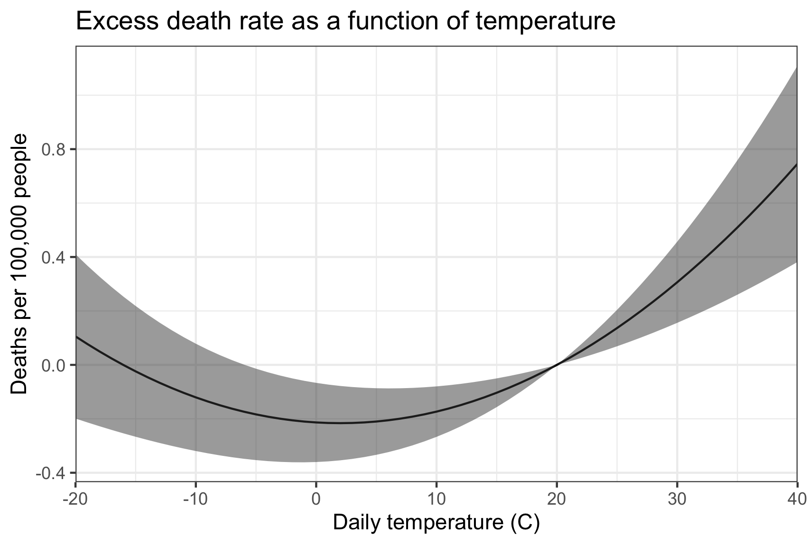

# Hands-on exercise, step 4: regression results

## Necessary libraries

In this step, we will perform econometric regressions and plot the
results. This requires some libraries, and we will also be calculating
confidence intervals by hand which requires some additional code or
libraries.


`````{tab-set}
````{tab-item} Python
We will use `PanelOLS` from `linearmodels` to perform the regression,
but we also need the `t` function to compute t values for the
confidence intervals. We will plot the result with `matplotlib`.

```python
import pandas as pd
import numpy as np
from linearmodels.panel import PanelOLS
from scipy.stats import t
import matplotlib.pyplot as plt
```
````

````{tab-item} R
We will use the `lfe` package to perform the regression and `ggplot2`
to graph the result.

To get confidence intervals from the `felm` function in `lfe`, we use
the `predict.felm` function from the `felm-tools.R` library at
https://github.com/jrising/research-common/blob/master/R/felm-tools.R


```R
library(dplyr)
library(lfe)
library(ggplot2)
source("felm-tools.R")
```
````
`````

## Merging weather and outcome data

Now we can merge in the mortality data! This is by county (FIPS
code) and year. We also construct the death rate, as deaths per
100,000 people in the population.

`````{tab-set}
````{tab-item} Python
```python
# Read data
clim = pd.read_csv("../data/climate_data/agg_vars.csv")
df = pd.read_csv("../data/cmf/merged.csv")

# Merge datasets
df2 = pd.merge(df, clim, how='left', left_on=['fips', 'year'], right_on=['FIPS', 'year'])

# Create new variable
df2['deathrate'] = 100000 * df2['deaths'] / df2['pop']
df2.loc[df2['deathrate'] == float("inf"), 'deathrate'] = np.nan
```
````

````{tab-item} R
```R
clim <- read.csv("../data/climate_data/agg_vars.csv")
df <- read.csv("../data/cmf/merged.csv")

df2 <- df %>% left_join(clim, by=c('fips'='FIPS', 'year'))

df2$deathrate <- 100000 * df2$deaths / df2$pop
df2$deathrate[df2$deathrate == Inf] <- NA
```
````
`````

If you have had problems in previous steps, you can download
ready-made copies of the aggregated climate data
([agg_vars.csv](https://raw.githubusercontent.com/atrisovic/weather-panel.github.io/master/example/data/climate_data/agg_vars.csv))
and the merged socioeconomic data
([merged.csv](https://raw.githubusercontent.com/atrisovic/weather-panel.github.io/master/example/data/cmf/merged.csv)). Note
that these may not match your results exactly, and in particular the
order of rows differs between python and R.

## Running the regression

Let's run our central regression, relating death rate to temperature. In keeping with the literature, we will assume that weather-related mortality is a u-shaped function. That is, both cold and hot temperatures cause increased mortality. We also assume that these effects are convex, so that more extreme cold and heat will produce a more-than-linear increase in mortality. The simplest relationship that has these features is a quadratic. Refer to the functional forms section for further considerations.

For fixed effects, we use county fixed effects, to account for unobserved constant heterogeneity, and state-specific trends, to account for gradual changes at a larger scale. While the high-resolution fixed effects are necessary and standard, the choice of trends can be more subtle. Here are a few points:

 - The high-resolution and more flexible the better, as far as identification is concerned. For example, we might consider county-specific trends, higher-order polynomials, or cubic splines. These better isolate weather shocks, which are the core of the identification strategy.
 - At the same time, flexible trends capture the variation necessary for statistical analysis. For example, a state-by-year fixed effect would leave very little variation at the county level, because counties weather is correlated within each state.
 - The right balance between these depends upon the other drivers affecting the dependent variable. It is useful to graph the timeseries for individual units and for groups of units (e.g., every county within a state). Trends should be imposed whereever there is non-weather-related drift in the dependent variable, and their resolution should be fine enough so that the values for all the contained regional units are drifting in the same way.
- Where reasonably researchers can disagree about the right trend specification, generate tables that show several specifications.  Typical sensitivity tests include more flexible fixed effects and functional forms and the inclusion of other weather variables. The R^2 values will help you understand how much of the variation you are capturing, but it is important to look at the resulting fit to decide if the regression is doing what you expect.

In our case, we see gradual shifts which are captured fairly well by state-level trends. We also only have 10 years of data, but with more data, more saturated fixed effects should be explored.

Here is our specification:

$$M_{sit} = \beta_1 T_{it} + \beta_2 T_{it}^2 + \gamma_i + \delta_s t$$

for mortality in state $s$, county $i$, year $t$.

Note that since we do not control for precipitation, temperature in
this case includes correlated effects of rainfall. As a result, it is
not ideal for future projections.

For academic work, it would be essential to consider a much wider
range of robustness checks, based on the considerations above. This
would include precipitation and other weather variables (such as
wet-bulb temperature), alternative fixed effects and flexible trends,
allowing for heterogeneity effects, and using a subset of the data
(e.g., only recent years). Alternative specifications should also be
explored, such as bins and cubic splines.

`````{tab-set}
````{tab-item} Python
We will first need to construct the state-level fixed-effects by hand,
by creating a state dummies and multiplying them by year values.

```python
# Categories and numbers
df2['state'] = (df2['fips'] / 1000).astype(int).astype(str)

# Drop rows with missing values
df2 = df2.dropna(subset=['deathrate', 'tas_adj', 'tas_sq'])

df2 = df2.set_index(['FIPS', 'year'])

# Create separate columns for state-specific trends using dummy variable expansion
state_dummies = pd.get_dummies(df2['state'], prefix='state')
state_trends = state_dummies.mul(df2.index.get_level_values('year'), axis=0)

# Fixed effects regression

# Merge the state-specific trends with the exogenous variables
exog = pd.concat([df2[['tas_adj', 'tas_sq']], state_trends], axis=1)

mod = PanelOLS(df2.deathrate, exog, entity_effects=True)
clustered = mod.fit(cov_type='clustered', cluster_entity=True)
```
````

````{tab-item} R
We need to create a state-level indicator, which will be used for the
state fixed-effects. We will also need to ensure that `year` is a
numeric value, not an integer, for `felm` to work properly.

```R
df2$state <- as.character(floor(df2$fips / 1000))
df2$year <- as.numeric(df2$year)

mod <- felm(deathrate ~ tas_adj + tas_sq | factor(state) : year +  factor(fips) | 0 | fips, data=df2)
```
````
`````

## Plotting the resulting dose-response function

To plot the result, we construct evenly sampled temperature from $-20^\circ$ C
($-4^\circ$ F) to $40^\circ$ C ($104^\circ$ F). Then we can
reconstruct the adjusted temperatures. The normalization we used
ensures that all of the reported values are relative to $20^\circ$ C,
so there are no confidence intervals at this point.

`````{tab-set}
````{tab-item} Python
The Python code here is a bit complicated, since we have to calculate
confidence intervals by hand. This also lets us ignore all of the
fixed effects.

```python
# Prediction dataframe
plotdf = pd.DataFrame({'tas': range(-20, 41)})
plotdf['tas_adj'] = plotdf['tas'] - 20
plotdf['tas_sq'] = plotdf['tas']**2 - 20**2

# Point estimate prediction
coefficients = clustered.params[0:2]
preds = plotdf[['tas_adj', 'tas_sq']]
prediction = np.dot(preds, coefficients)

# Confidence interval prediction
vcov = clustered.cov.iloc[0:2, 0:2]
ses = np.sqrt(np.diag(np.dot(np.dot(preds, vcov), np.transpose(preds))))
degfree = len(df2) - len(clustered.params) - clustered.df_model - 1
ci_upper = prediction + t.ppf(0.975, degfree) * ses
ci_lower = prediction + t.ppf(0.025, degfree) * ses

# Create final dataframe for visualization
plotdf2 = pd.concat([plotdf, pd.DataFrame({'y': prediction, 'cilo': ci_lower, 'cihi': ci_upper})], axis=1)

# Plotting
plt.figure(figsize=(10, 6))
plt.plot(plotdf2.tas.values, plotdf2.y.values)

# Confidence interval
plt.fill_between(plotdf2.tas, plotdf2.cilo, plotdf2.cihi, color='grey', alpha=.5)

plt.xlabel('Daily temperature (C)')
plt.ylabel("Deaths per 100,000 people")
plt.title('Excess death rate as a function of temperature')
plt.grid(True)
plt.show()
```
````

````{tab-item} R
```R
plotdf <- data.frame(tas=seq(-20, 40))
plotdf$tas_adj <- plotdf$tas - 20
plotdf$tas_sq <- plotdf$tas^2 - 20^2

preddf <- predict.felm(mod, plotdf, interval='confidence')

plotdf2 <- cbind(plotdf, preddf)

ggplot(plotdf2, aes(tas, fit)) +
    geom_line() + geom_ribbon(aes(ymin=lwr, ymax=upr), alpha=.5) +
    scale_x_continuous(name="Daily temperature (C)", expand=c(0, 0)) +
    ylab("Deaths per 100,000 people") +
    ggtitle("Excess death rate as a function of temperature") + theme_bw()
```
````
`````



The estimated dose-response function suggests that counties with an average temperature higher than about 2 deg C observe increases in mortality when the temperature rises and decreases in mortality when it falls. Counties with very cold average temperatures see the opposite-- for them, warmer temperatures reduce mortality.

Since baseline mortality rates are different in each county, the dose-response function can only tell us about the effect of changes. So, for example, relative to the mortality expected on a 20 deg C day, a 30 deg C day is projected to result in 0.3 additional deaths per 100,000, equivalent to deaths attributable to all natural disasters in the US.
