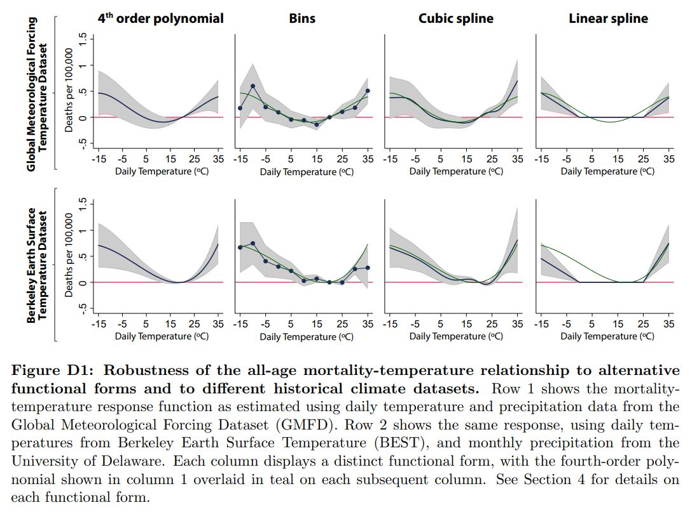

# Functional forms: pros, cons, and methods

Returning to the "true model" of your process, the decisions around how to
generate a linear expression that you can estimate have important
implications. Different functional forms serve different purposes and
describe different underlying processes. Some of the frequently used functional forms along with a good reference for understanding them in detail are listed below. For the ease of notation in this section, we get rid of timestep $s$ and instead work with more aggregated time values $t$.

## [Bins](https://en.wikipedia.org/wiki/Data_binning)

Binning is a data classification technique in which observations are assigned 
to specific bins, which correspond to a range of data. For example, histograms
are used to observe frequency distributions of the data.
Bins offer a very flexible functional form, although the choice of bin
edges means that they are not as "non-parametric" as often assumed. It
is also highly sensitive to existence of outliers in data. This can
particularly be an issue for extrapolation when the results are used
for projections: only the estimate for the extreme bins will be used.

The bin widths should generally be even to facilitate easy
understanding, although the lowest and highest bins can go to negative
and positive infinity (or the appropriate analog). You may want to
have smaller size bins around weather values where we expect most of
the response to occur and where there is a lot of data, but be
prepared to also show evenly-spaced bins.

The interpretation of a binned result is in terms of the time unit
used. For example, if daily temperatures are used, then the marginal
effect for a given bin is the additional effect of "one more day" for
which the temperature falls into that bin.

To calculate bin observations, count up the number of timesteps where
the weather predictor falls into each bin:

$$X_{it} = \sum_{p \in i} \psi_{p} \sum \mathbf{1} \left \lbrace {X_{p i t} \in Bin_k} \right \rbrace$$

where $\psi_{p}$ is the weight assigned to the $p$ grid cell.  

## [Polynomial](https://en.wikipedia.org/wiki/Polynomial_regression)

Polynomial specifications balance smooth dose-response curves with the
flexibility of increasing the effective resolution of the curve by
increasing the degree of the polynomial. Using more degrees improves
the ability of the curve to fit the data, but may lead to
over-fitting. To choose the number of terms in the polynomial,
consider [cross-validation](#cross-validation).

Another benefit of polynomials for climate change estimates is that
they provide smooth extrapolation to higher temperatures. Again, it is
important to highlight the fact that the evaluation of the
dose-response curve at temperatures outside the bounds of the observed
data reflects assumptions, rather than evidence. Cross-validation that
leaves out the latest periods or most extreme temperatures can improve
confidence in these assumptions.

In calculating the predictor values for a polynomial, consider the
scale of the data-generating process. If it is a local process, the
high-resolution weather values should be raised to powers before
aggregating up to the regions in the economic data. That is, the 
predictor for the $k$-th power of the polynomial is 

$$f(X_{it}^k)=\sum_{p \in \Theta(i)} \psi_{p} X_{p i t}^k$$ 

where $\psi_{p}$ is the weight assigned to the $p$ grid cell.  
    
The dose-response regression would then be applied as follows

$$F(X_{it})=\sum_{k} \beta_k f(X_{it}^k)$$
	
while the coefficients can be interpreted as describing a local
dose-response relationship:

$$F(X_{pit})=\sum_{k} \beta_k X_{pit}^k$$

## [Restricted cubic spline](https://support.sas.com/resources/papers/proceedings16/5621-2016.pdf)

Restricted cubic splines produce smooth dose-response curves, like
polynomials, but mitigate some of the problems that polynomials with
many terms have. Whereas polynomials with high-order terms can produce
very extreme results under extrapolation, RCS always produces a linear
extrapolation. RCS also provides additional degrees of freedom through
the placement of knots, and this can be used either to reflect
features of the underlying process being modeled or to improve the
fit.

In the case where knots are chosen to maximize the fit of the curve,
cross-validation is the preferred approach for both selecting the
number of knots and their placement. The reference in this subsection
title on cubic splines can be helpful in deciding the knot
specifications.

Once knot locations are determined, the weather data needs to be
translated into RCS terms. As before let the gridded weather variable be $X_{p i t}$ 
and let there be $n$ knots, placed at $X_1 < X_2 < ... < X_n$.
Then we have a set of $(n-2)$ terms, here indexed by $k$ and defined as:

$$f(X_{i t})_k = \sum_{p \in \Theta(i)} \psi_{p} \{(X_{p i t}-X_k)^3_+ - (X_{p i t} - X_{n-1})^3_+ \frac{X_n-X_k}{X_n-X_{n-1}} + (X_{p i t} - X_{n})^3_+ \frac{X_{n-1} - X_k} {X_{n}-X_{n-1}}\}$$ 

$$\forall k \in \{1,2,...,n-2\}$$

where, $\psi_{p}$ is the weight assigned to the $p$ grid.  
    
Each spline term in the parentheses $(\nabla)^3_+$ e.g. $(X_{p i t} - t_{n-1})^3_+$ is called a truncated polynomial of degree 3, which is defined as follows:  

$\nabla^3_+=\nabla^3_+$ if $\nabla^3_+>0$

$\nabla^3_+=0$ if $\nabla^3_+<0$  
    
As with the polynomial, the dose-response regression would then be applied as follows

$$F(X_{it})=\sum_{k} \beta_k f(X_{it})_k$$
	
while the coefficients can be interpreted as describing a local
dose-response relationship:

$$F(X_{pit})=\sum_{k} \beta_k {X_{pit}}_k$$

## [Linear spline](https://web.archive.org/web/20200226044201/http://people.stat.sfu.ca/~cschwarz/Consulting/Trinity/Phase2/TrinityWorkshop/Workshop-handouts/TW-04-Intro-splines.pdf)

A linear spline provides a balance between the smoothness of RCS and
the direct response curve to temperature correspondence of bins. The
segments between knots here are lines. As with RCS, the choice of knot
locations is very important.

One definition of terms for a linear spline for a spline with $n$ knots at
$X_1 < X_2 < ... < X_n$ is:

$$f(X_{it})_0=\sum_{p \in \Theta(i)} \psi_{p} X_{p i t}$$
$$f(X_{it})_k=\sum_{p \in \Theta(i)} \psi_{p} (X_{p i t}-X_k)_+$$

where, $\psi_{p}$ is the weight assigned to the $p$ gridcell.  

And, each spline term in the parentheses $(\nabla)_+$ e.g. $(X_{p i t} - X_2)_+$ is called a truncated polynomial of degree 1, which is defined as follows:  

$\nabla_+=\nabla_+$ if $\nabla_+>0$ 

$\nabla_+=0$ if $\nabla_+<0$ 

We generally try to work with many functional forms in a paper because it serves dual purpose of being a *sanity check* for researchers' code and a *robustness check* for readers' confirmation. However, we need to take decision on the *main specification* that we want in the paper. To do this, we formally rely on tests such as cross-validation (explained below), but we can also eyeball at the *fit* of different functional forms by printing overlaid graphs in a way that is suitable for the exercise. An example is shown in the figure below:

**Example of reduced-form regression plots for different functional forms**

Source: [Carleton et al. (2019)](https://papers.ssrn.com/sol3/papers.cfm?abstract_id=3224365).

## Cross-validation

Cross-validation can be done to check the *internal validity* and the *external validity* of the model estimates. For checking
internal validity, the model can be fit to a subset of the dataset,
and evaluated on the remainder. For example, you can leave particular
regions out of your regression or remove a random *1/k* of your data
(k-fold cross-validation) instead of running a full-sample
regression. For gauging external validity, the model is run on some new dataset that has not been used in the model evaluation process. For example, by predicting the response for a new country using global regression model estimates and comparing it to the actual observations.  

Cross-validation is not universally performed by researchers, and many
people continue to rely only on R-squared statistics. However,
R-squared statistic can perform poorly even in very simple cases. Therefore, cross-validation can be an effective approach for doing model-selection.  

Some examples of the use of cross-validation exercise include deciding
on degree of polynomial, cutoff knots' positions for splines,
and selecting weather variables for regression. To do a k-fold 
cross-validation exercise for deciding on polynomial degree, we run our test
specifications (say polynomials of degree 2, 3, 4 and 5) on the data,
each time excluding a subset, and evaluate how well the fitted model
predicts the excluded data. To fix a metric for making this decision,
we can rely on root-mean-square-error (RMSE) statistics. So, the
specification with the lowest RMSE will be the most preferred
specification here. Having said that, we usually employ a combination of
techniques, such as interpretability and RMSE, to make a decision on the most preferred specification.
