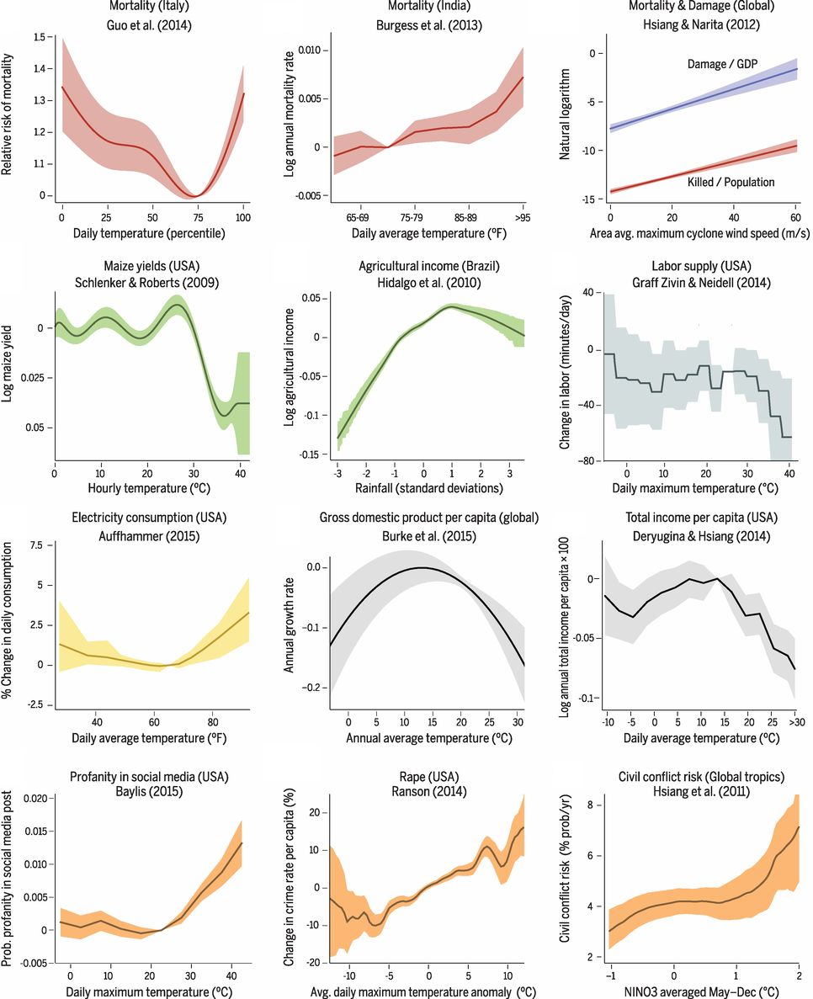

# Introduction to the Tutorial

The use of econometrics to study how social, economic, and biophysical
systems respond to weather has started a torrent of new research. It
is allowing us to better understand the impacts of climate change,
disaster risk and responses, resource management, human behavior, and
sustainable development. Here are some of the relationships that have
been uncovered in recent years:

Source: [Carleton and Hsiang (2016)](https://science.sciencemag.org/content/353/6304/aad9837).

Relationships like these that relate weather to socioeconomic outcomes
are opening new questions even as they provide answers. In the figure
above, there are response functions for mortality, agriculture, and
conflict that have been estimated for both rich and poor
countries. Interestingly, these often do not match up, and their
differences can help us to better understand vulnerability and the
potential for adaptation.

Many different functional forms are represented in the figure above,
and behind these are many more decisions about the choice of weather
variables, the handling of heterogeneity and variability, and how
socioeconomics information can be mapped to geography.

While the challenges of climate econometrics are similar across all
problems, the appropriate solutions to these problems are unique to
each research question. No single sequence of steps or software can be
widely applied for resolving these issues. Instead, this tutorial is
aimed at helping you make decisions appropriate to your research.

# Who should use this tutorial?

This tutorial is aimed at students and researchers new to climate
econometrics. We will assume a knowledge of panel econometrics. You
should be familiar with specifications that factor-out unobserved
heterogeneity, implementing flexible trends, weighted regressions,
approaches to deal with heteroskedasticity and correlated errors, and
diagnosing efficiency problems. Some concepts in panel econometrics
are more specific to weather regressions, such as dose-response
curves, data-generating processes, and neighborhood effects, and we
will cover those below.

We also assume basic experience with one scientific programming
language (Stata, R, Matlab, Julia, python). We try to provide examples
in more than one language, so you can get started.

You should also already have a research question. There are plenty of
ways to find important questions, and maybe we will try to offer a
tutorial on that in the future.

# What we hope you will learn

This tutorial is designed to offer guidance on all of the steps
necessary to contribute to this research, by walking you through the
steps necessary to relate socioeconomic outcomes to weather data at
high resolution. We will cover:

1. How to find and use weather data, and what you should be aware of when using it.
2. How to relate your socioeconomic outcomes to weather variables, and
   develop your regression specification.
3. How to work with shapefiles, and use them to generate your
   predictor variables.

At the same time, this tutorial asks you to perform every step
yourself. In particular, we do not provide prepared weather data or a
ready-made script to prepare it. Each particular project is too specific,
so you, the researcher, need to think through everything. This
tutorial is aimed at helping you do that.

# How to use this tutorial

The tutorial is organized along the rough outline of a research
project: 

1. *Using weather and climate data*: introduces the data and its attributes, the NetCDF file format, supported programming languages, and common limitations of the data.
2. *Developing a reduced-form specification*: provides a number of considerations before starting an analysis, such as choosing weather variables, functions for creating a model, and caveats when working with spatial and temporal processes.
3. *Weighting schemes*: explains the importance of weighting schemes and how to work with them based on their file formats and origins. 
4. *Generating geographical unit data*: introduces geographic information systems, shapefiles, and how to work with them effectively.

You can go through the sections one at a time or jump around.

Most importantly, if you learn something in your own research process
that you think would be of broad interest, see the *Contributions*
section for how to include it here. Help us make this tutorial more
useful for more people!

# Some introductory concepts

A useful resource to better understand the basics of weather, climate,
and the physical changes occurring in the climate system
is
[An Economist’s Guide to Climate Change Science](https://www.aeaweb.org/articles?id=10.1257/jep.32.4.3). If
you have not had experience with climate (or meteorological) science,
that is a great place to start. For a more general introduction to the
sciences of climate and climate change, check out the [Encyclopedia of
Earth](https://editors.eol.org/eoearth/wiki/Weather_%26_Climate) and the [IPCC WGI report](https://www.ipcc.ch/site/assets/uploads/2017/09/WG1AR5_Chapter01_FINAL.pdf).

For a theoretical foundation for the work of estimating weather and
climate responses,
read
[Climate Econometrics](https://www.annualreviews.org/doi/10.1146/annurev-resource-100815-095343) by
Solomon Hsiang. This tutorial complements this kind of theoretical
foundation with more practical advice.

## Definitions and conventions

We will use the following terms throughout this tutorial.

### Point data, region data, and gridded data

The data being related in climate econometric studies comes in three
forms:
1. Point data describes the conditions at a particular geographic
   point in space. For weather data, this is typically the location of
   a weather station or gauge. For socioeconomic data, it may be a
   field, factory, or household.
2. Region data describes an aggregate over an irregular space. Typical
   natural science regions include basins and water/land bodies. But
   economic region data is much more common, where quantities are
   totaled across an entire political unit before they are
   reported. The region over which a data point is provided is the
   geographic unit.
3. Gridded data provides information on a regular grid, almost always
   either across latitude and longitude, or distance north and
   east. Gridded data can come from remote sensing products or other
   models or analyses. In the latter case, it often is not clear
   exactly what is being measured (e.g., the point data at the
   centroid, or the average over a rectangular region). Keeping
   information at a high resolution is important to avoid misusing such data.
   
It is always appropriate to analyze data in the spatial structure it
is offered, even if translating it to another structure would be
easier. We will discuss this more later.

### Mathematical notation

In many cases, it will be useful to describe how to work with weather
variables irrespective of the specific data being represented. For
this, we introduce the following notation:

- $T_{it}$: Any weather variable for geographic unit $i$ in reporting period $t$.
- $T_{ps}$: Point or grid-level weather data for location/grid cell
  $p$, at a native temporal resolution indexed by $s$.
